## Data Warehouse - Case Pata Amiga

Este projeto é uma atividade avaliativa do curso de análise de dados do SCTEC, módulo 2. 
O objeto é implementar um Data warehouse para a rede de petshops **Pata Amiga**.

O projeto contempla a modelagem dimensional, tratamento de dados de staging, carga da tabela fato/dimensões e respostas orientadas a perguntas de negócio usando o MySQL.

---

## Sobre o Case

A **Pata Amiga** é uma rede varejista do setor pet. O objetivo deste projeto é consolidar os dados operacionais dispersos em uma arquitetura dimensional otimizada em MySQL 8.0, permitindo análises precisas sobre faturamento, logística de entregas, desempenho de canais de vendas, impacto de descontos e expansão geográfica.

---

##  Arquitetura e Modelo Dimensional

O modelo adotado é o **Star Schema (Esquema Estrela)** centrado na tabela fato de pedidos (`fato_pedido`), operando no grão **1 linha = 1 pedido** (totalizando 4.044 registros válidos).

### Características Principais do Modelo:

- A tabela `dim_tempo` é conectada duas vezes à fato (`sk_tempo_pedido` e `sk_tempo_entrega`), permitindo analisar independentemente a data da compra e a data de conclusão da entrega.

- Como uma loja atende a múltiplas praças com diferentes pesos de atendimento, utiliza-se a tabela `bridge_loja_praca` ligada pelo código natural da loja (`cod_loja`) para realizar o rateio proporcional correto sem distorcer o modelo.

- Nenhuma chave estrangeira (FK) na tabela fato assume valores nulos; registros ausentes ou corrompidos apontam para a linha padrão `-1` ("Não Informado").

> **Diagrama do Modelo Estrela:**

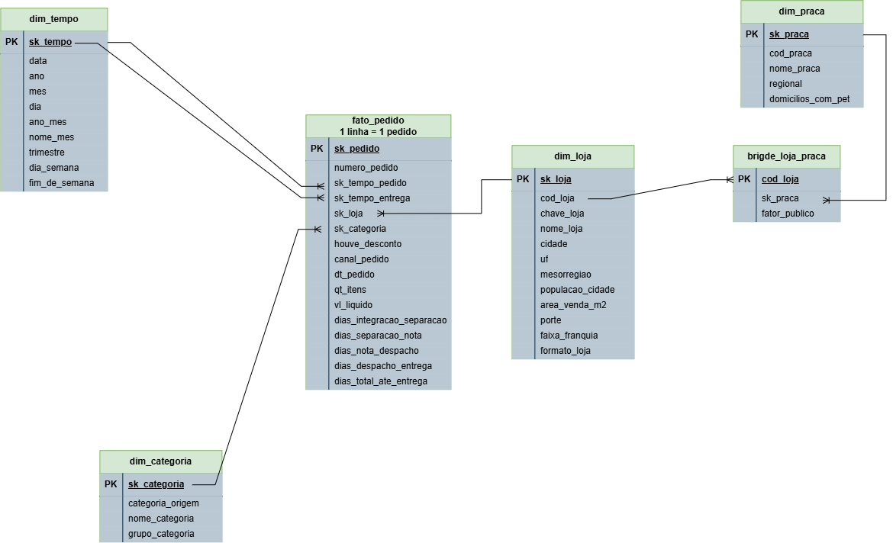

---
## Ordem de Execução dos Scripts SQL

Para reproduzir o banco de dados do zero em um ambiente MySQL 8.0, execute os arquivos na seguinte sequência lógica:

1. **`01-carga-staging.sql`** *(Fornecido pelo case)*: Cria o banco de dados `dw_pata_amiga` e carrega as tabelas de staging brutas (`stg_pedido`).
2. **`02-dimensoes-e-estruturas.sql`**: Configura a `dim_tempo` (já populada), a `dim_loja` e inicializa as estruturas vazias das tabelas `dim_categoria`, `dim_praca`, `bridge_loja_praca` e `fato_pedido`.
3. **`03-carga-dimensoes.sql`**: Popula as dimensões auxiliares aplicando as limpezas de texto e regras de negócio.
4. **`04-carga-fato.sql`**: Executa a carga única (`INSERT INTO ... SELECT`) da tabela `fato_pedido`, aplicando as conversões de datas americanas, formatação de valores monetários, tratamento de nulos para `-1` e cálculo dos tempos de processo (`DATEDIFF`).
5. **`05-perguntas.sql`**: Consultas que respondem as 5 perguntas de negocio.
6. **`06-diagnostico_origem.sql`**: Consultas que respondem as perguntas de diagnóstico inicial dos dados.

---

## Tarefa 1: Diagnóstico da Origem 

As tabelas de staging estão com vários problemas nos dados.
Os SELECTS que respondem as perguntas de dignóstico da origem estão no arquivo 06-dianostico_origem.sql

- Quantas grafias de loja existem? 
- Quantas de categoria? 
- Quantos pedidos vieram sem código de loja? 
- Quantos sem nome de loja? 

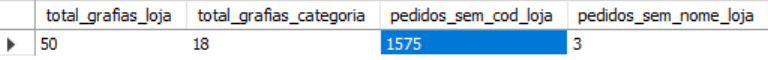

- Quantos marcos de processo estão em branco?

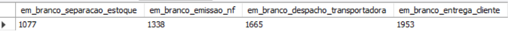

---

## Tarefa 2: Tratatamentos

Para garantir a integridade dos dados e a consistência analítica do modelo dimensional, foram aplicados tratamentos  nas etapas de transformação e carga das dimensões e da tabela fato:

1. **Tratamento nas Dimensões (dim_categoria e dim_praca)**: 
    - Padronização de Categorias (dim_categoria): Os nomes crus da origem (CategoriaProduto) foram mapeados através de condicionais CASE WHEN para agrupar variações textuais em categorias oficiais limpas (nome_categoria), além de classificá-las grupos de negócio (grupo_categoria como Alimentação, Saúde e Higiene e Bem-estar).

    -   Limpeza de Indicadores Populacionais (dim_praca): Na tabela de praças, o campo de domicílios com pet continha formatação de separador de milhar (ex: '148.000'). Utilizou-se a função REPLACE combinada com CAST para converter a string em um número inteiro tratável (SIGNED).

    - Tratamento de Nulos com a Linha -1: Todas as dimensões receberam a linha padrão sk = -1 ("Não Informado"). Nenhuma chave estrangeira na fato assume valores nulos (NULL), garantindo integridade referencial.

2. **Tratamento na Tabela Ponte (bridge_loja_praca)**:
    - Conversão de Fatores de Rateio: Os percentuais de público da tabela ponte (PercentualPublico) que vieram em formato textual com vírgula (padrão brasileiro) foram convertidos utilizando REPLACE para o ponto decimal e transformados no tipo DECIMAL(5,2), viabilizando o cálculo correto do rateio proporcional por praça sem distorcer a soma do faturamento.

3. **Tratamento na Tabela Fato (fato_pedido)**:
    - Conversão e Padronização de Datas: A data e hora do pedido (DtHoraPedido) foi convertida do formato americano com AM/PM usando estritamente a máscara STR_TO_DATE(..., '%m/%d/%Y %h:%i %p') para evitar falhas silenciosas. O resultado foi transformado na chave inteira da dim_tempo no formato AAAAMMDD via DATE_FORMAT.

    - As datas de entrega em branco, nulas ou preenchidas com traços ('-') foram tratadas condicionalmente para apontar para a chave padrão -1.

    - Resolução de Chaves por LEFT JOIN (Lojas e Categorias):

    - A identificação da loja tratou variações de digitação e abreviações da origem (como Blumenal, Floripa, Jgua do Sul) e a remoção de sufixos estaduais (/SC) por meio de REPLACE e CASE WHEN aninhados no ON do JOIN com a dim_loja.

    - Registros sem correspondência de loja ou categoria receberam o valor padrão -1 via COALESCE.

    - Padronização das colunas categóricas-(houve_desconto e canal_pedido):
        - O campo de desconto foi normalizado em Sim, Nao ou Nao informado. 
        - O canal de atendimento foi limpo por regras de correspondência textual (LIKE), priorizando termos específicos (como testar "WhatsApp" antes de "App" devido à sobreposição de substrings).

    - Limpeza de Campos Numéricos e Monetários:

        - Quantidades de itens e valores líquidos que continham caracteres textuais inválidos (como '', '-', prefixos 'R$' ou pontos de milhar) foram higienizados e convertidos com segurança para os tipos numéricos adequados (SIGNED e DECIMAL(15,2)).

        - Cálculo de Lags Operacionais (DATEDIFF):

        -   Os intervalos em dias entre as etapas do processo (Integração → Separação → Nota Fiscal → Despacho → Entrega) foram calculados estritamente na carga utilizando DATEDIFF. Etapas operacionais ainda não concluídas (com datas nulas ou em branco) receberam corretamente o valor NULL (nunca zero), preservando a precisão das médias estatísticas.
---

##  Respostas às Perguntas de Negócio

Os SELECTS que respondem essas perguntas estão no arquivo 05-perguntas.sql

 **P1 : Onde está o gargalo da entrega? Qual o tempo médio, em dias, entre o pedido entrar no ERP e chegar na casa do cliente? E qual dos quatro intervalos do processo  Integração → Separação, Separação → Nota, Nota → Despacho, Despacho → Entrega  é o mais lento?**

Resposta: o tempo medio em dias para uma entrega são 9 dias. O processo mais lento é Nota -> Despacho, com media de 4,11 dias.
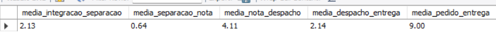

**O gargalo é o mesmo nos três portes de loja?**

Resposta: o gargalo é o mesmo em todos os portes de loja (nota -> despacho) mas observa-se que na loja de porte pequeno a media dessa operação é muito superior (8,53 dias) do que nas lojas de porte medio e grande (~3,3 dias). 

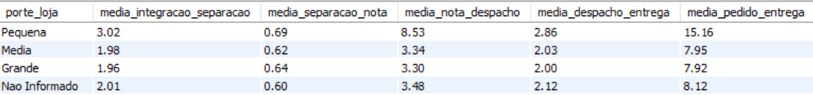

### P2: Qual categoria concentra o faturamento?
Resposta: A categoria de **Ração** lidera o faturamento da rede em **todos os três portes de loja** (Pequena, Média e Grande).

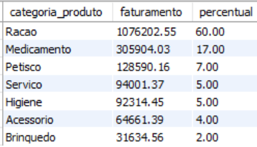

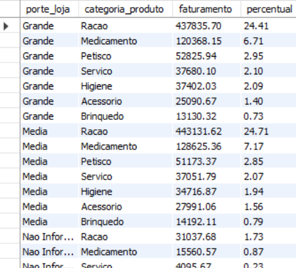

### P3: O desconto funciona igual em todo canal?
Resposta: Os dados provam que a aplicação de descontos **derruba o ticket médio em todos os canais de venda** da rede.

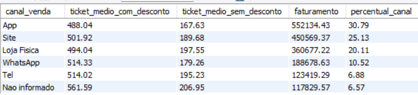

### P4: Qual praça de atendimento concentra o faturamento?
 A região do **Vale do Itajaí** concentra o maior faturamento rateado.
* **OBS** Houve uma diferença de **R$ 58.047,36** entre o faturamento total da rede bruta (R$ 1.793.308,51) e a soma do rateio por praças (R$ 1.735.261,16). Essa variação ocorre devido a pedidos oriundos de lojas sem código e nome identificados na origem, que portanto não encontraram correspondência na tabela ponte.

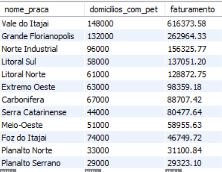

### P5: Onde abrir a próxima loja e o que os dados não permitem afirmar:
* **Ranqueie as lojas por itens vendidos por mil habitantes da cidade  não em valor absoluto  e cruze com o tempo médio de entrega:**
 as praças com maior densidade de consumo per capita e eficiência logística estão no topo do ranking.

 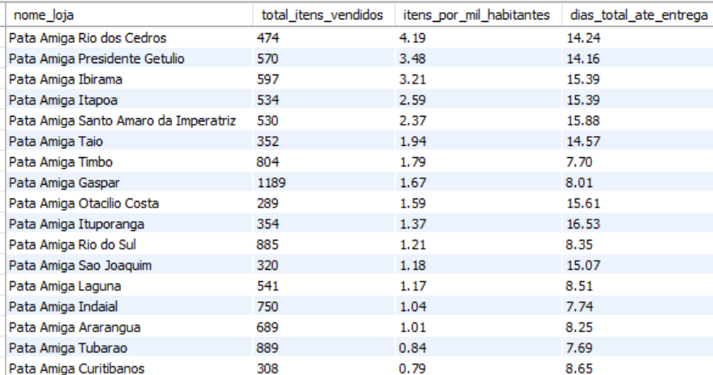

    
* **Limitação da Faixa de Franquia (SCD Tipo 1):** Analisar o faturamento pela faixa atual de franquia **não** responde "quanto veio de lojas que já eram Ouro na data do pedido", pois o banco sofre de sobrescrita de histórico (o cadastro guarda apenas o status atual, mascarando o porte que a loja possuía no momento da venda no passado).

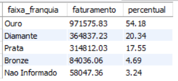

* **Auditoria de Exclusões:**
  * Pedidos sem loja identificada (chave `-1`): **129**.
  * Entregas não concluídas (`sk_tempo_entrega = -1`): **1.953** pedidos.
  * Itens em branco/nulos: **257**.
  * Valores em branco/nulos: **121**.

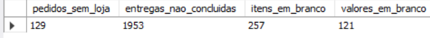
